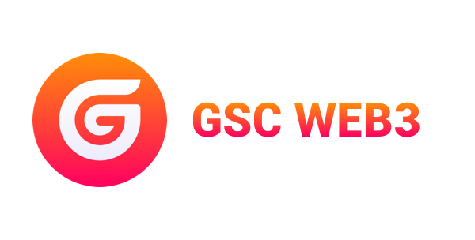

# GSCWeb3.js - GSC JavaScript API

This is the GSC JavaScript API
which connects to the Generic JSON RPC spec.

You need to run a local or remote GSC node to use this library.

Please read the documentation for more.

## Installation

### Node

```bash
npm install gscweb3
```

### Yarn

```bash
yarn add gscweb3
```

## Usage

```js
import GSCWeb3 from 'GSCWeb3';

const GSCWeb3 = new GSCWeb3({
    fullHost: 'http://localhost',
    eventServer: 'http://localhost',
    privateKey: 'your private key'
  }
);

```

## Recent History

__1.0.0__


## Licence

GSCWeb3 is distributed under a GNU licence.
